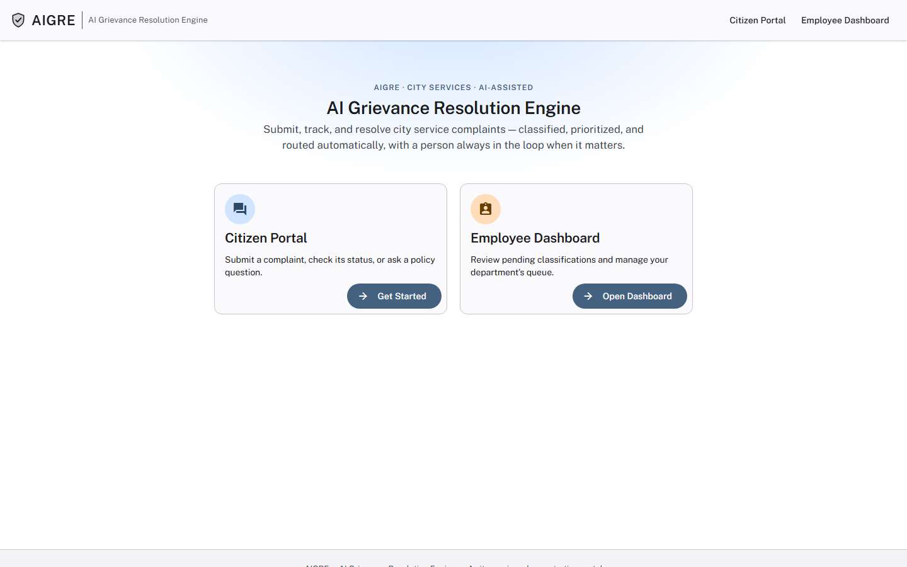
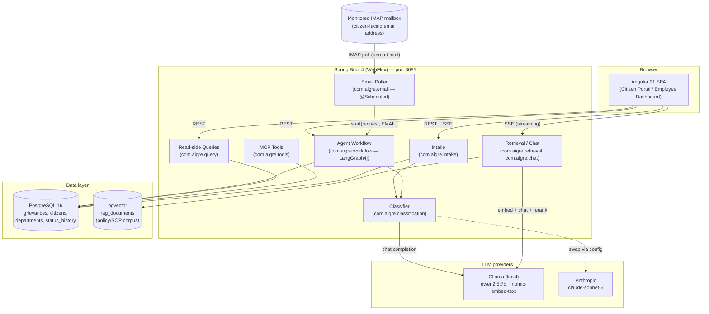
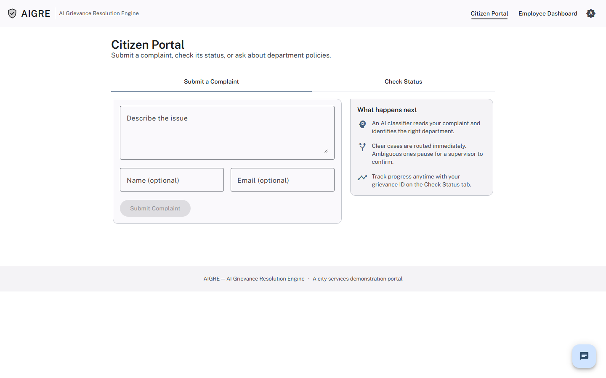
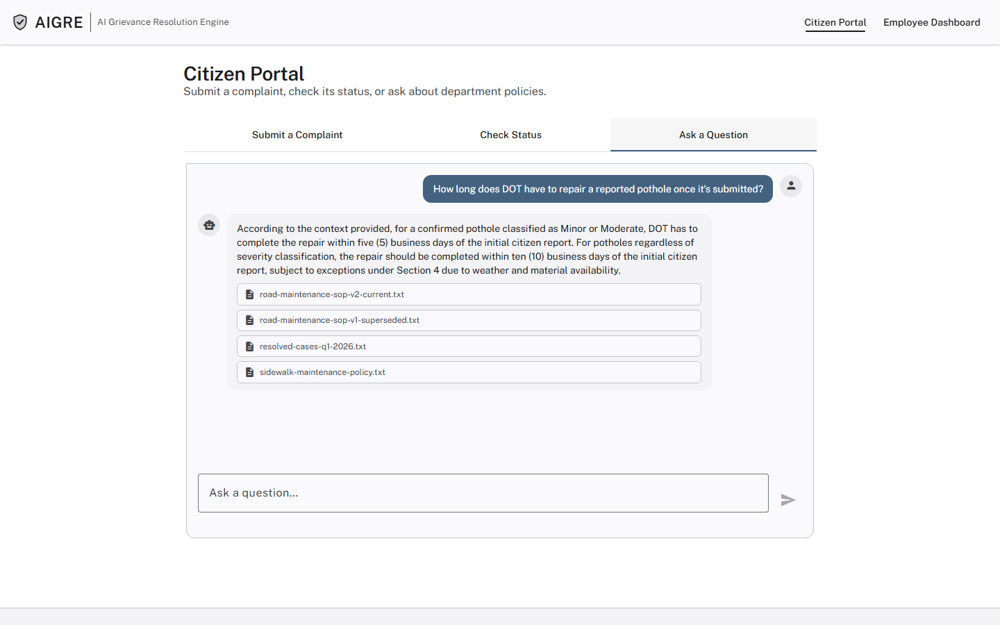
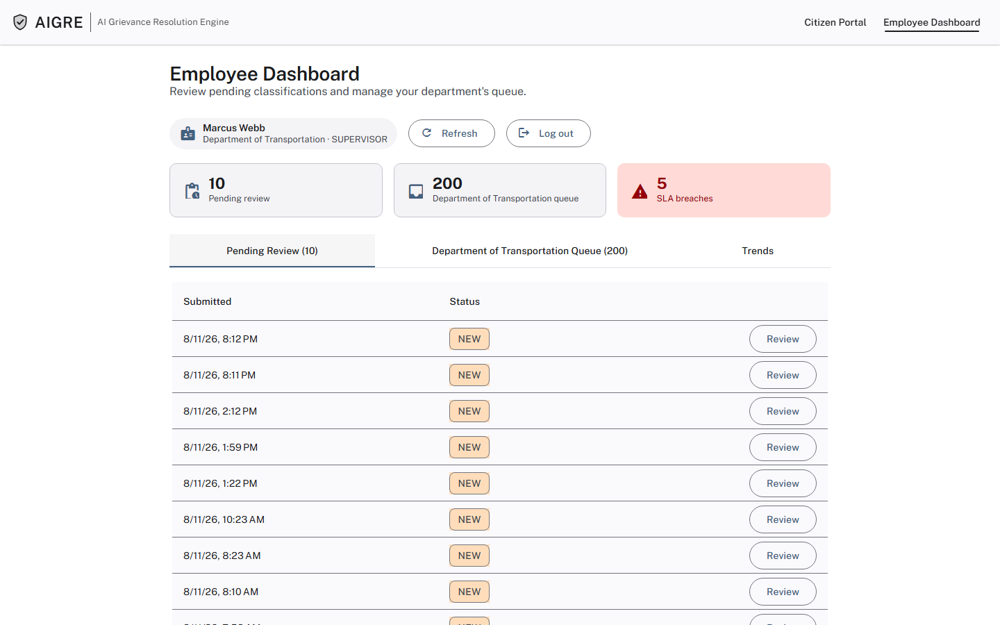
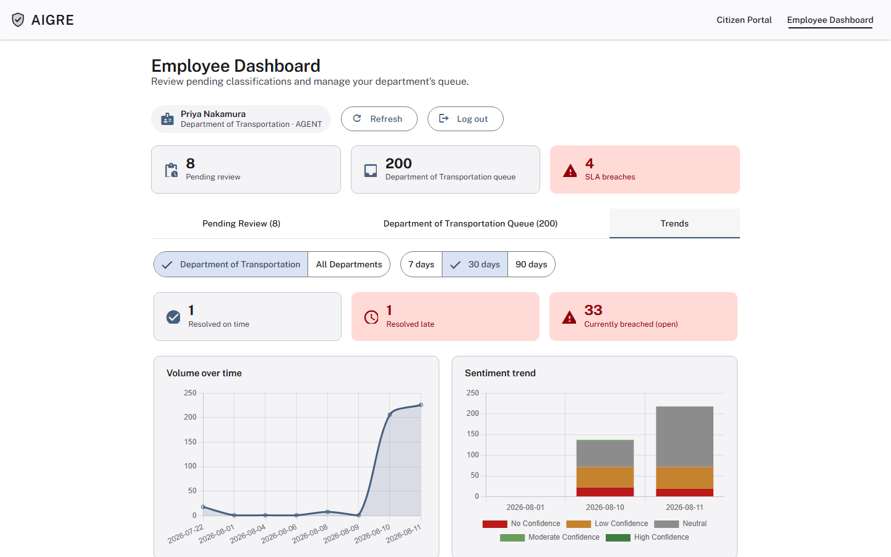

# AIGRE — AI Grievance Resolution Engine

**A G2C (government-to-citizen) system for intake, AI classification, routing, and
resolution tracking of city service complaints.** A citizen reports a pothole, a broken
streetlight, a suspected code violation — by web form or by email — and AIGRE
classifies it, assigns a department and priority, checks for duplicates, computes an
SLA deadline, and routes it to the right queue, pausing for a human decision whenever
its own confidence is genuinely too low to act alone.

Built as a full-stack reference implementation of applied LLM engineering: not "call an
API and hope," but classification with a defined correctness contract, retrieval that's
measured against labeled eval data, and a human approval gate that's a first-class
workflow state rather than a bolted-on afterthought.



---

## Contents

- [What it does](#what-it-does)
- [Where AI is actually used](#where-ai-is-actually-used)
- [Tech stack](#tech-stack)
- [Architecture at a glance](#architecture-at-a-glance)
- [Screenshots](#screenshots)
- [Getting started](#getting-started)
- [Demo credentials](#demo-credentials)
- [Documentation](#documentation)
- [Testing](#testing)
- [Project status](#project-status)
- [Known limitations](#known-limitations)

---

## What it does

**For citizens** (`/citizen`, no login required):
- Submit a complaint as free text — no department dropdown to guess wrong. AI infers
  the department, category, and priority.
- Get an instant receipt: assigned department, priority, SLA due date — or, if the
  system genuinely can't tell what's being reported, a request for more detail instead
  of a bad guess.
- Check the status of an existing complaint by ID at any time.
- Reopen a closed complaint if the issue recurs (priority bumps up a tier automatically).
- Ask policy questions in a chat interface ("How long does DOT have to fix a pothole?")
  and get an answer grounded in the actual policy corpus, with a citation — or an
  honest "I don't have that" instead of a fabricated answer.
- Email a complaint instead of using the form — a monitored inbox is polled on a
  schedule and every message goes through the identical pipeline as a portal
  submission.

**For department employees** (`/employee`, real login required):
- Review the **Pending Review** queue — complaints the AI wasn't confident enough to
  route on its own, shown with the model's own reasoning, so the reviewer knows *why*
  it paused, not just that it did.
- Work a department queue: status, category, priority, SLA due date, and duplicate
  links, with an at-a-glance channel indicator (email vs. portal).
- Mark complaints resolved or closed, or resume a paused review with a decision.
- View a **Trends** dashboard: complaint volume, sentiment distribution, top
  categories, priority breakdown, and an SLA compliance snapshot.
- A cross-department **ADMIN** role gets every department's data in one view, with an
  optional department filter, instead of being scoped to one department like every
  other role.

Six departments are modeled with deliberate topic overlap (Transportation/Public Works,
Health & Human Services/Education, Public Works/Housing, Environmental
Protection/Public Works) specifically so the classifier has to make real judgment
calls, not obviously-disjoint categories.

---

## Where AI is actually used

Four distinct, purpose-built uses — each with a defined correctness contract and a
human checkpoint where the model's confidence is genuinely insufficient. Full detail,
including the actual prompts and measured accuracy numbers, is in
[`docs/ARCHITECTURE.md`](docs/ARCHITECTURE.md#where-ai-is-used-the-core-of-this-doc).

1. **Grievance classification** — one structured LLM call determines department,
   category, priority, confidence, and sentiment. Reason-before-verdict prompting (the
   model justifies itself before a machine-parsed result line), a deterministic
   priority rubric the model *applies* rather than invents, and explicit permission to
   say "not confident" instead of forcing a guess. Measured head-to-head against a
   91-case labeled eval set: Anthropic's Claude Sonnet 5 scores ~95.6%, the local
   Ollama model (`qwen2.5:7b`) 65.9–86.8% — the local model stays the default (free,
   offline) with the stronger model one config line away.
2. **Retrieval-augmented chat** — hybrid vector + full-text search over a 108-document
   policy corpus, LLM-reranked (not cosine-only — a measured false positive proved raw
   similarity alone isn't good enough), answered strictly from the retrieved text with
   a citation, refusing rather than fabricating when the corpus doesn't have the
   answer.
3. **Agentic workflow with a human approval gate** — a LangGraph4j state graph
   (`classify → human_review (if unconfident) → commit`) that genuinely *pauses*
   execution — not just flags a row — when confidence is too low, and resumes only when
   a supervisor makes a decision. The single most deliberate AI-safety mechanism in the
   system.
4. **MCP tool server** — 5 grievance operations (status lookup, SLA check, duplicate
   chain walk, status update, reopen) exposed over the real Model Context Protocol
   (Streamable HTTP), so an external agent could operate on the system the same way a
   human uses the dashboard.

Plus two cross-cutting concerns: a **PII redaction guardrail** on every citizen
free-text field, and **observability** (every LLM/retrieval call timed and tagged under
one Micrometer metric family, scraped in Prometheus format) — because "the critic step
was 53% of total runtime" is the kind of thing you should never have to guess about.

---

## Tech stack

| Layer | Technology |
|---|---|
| Backend language/runtime | Java 21 |
| Backend framework | Spring Boot 4.0.6 (WebFlux — reactive, non-blocking) |
| LLM orchestration | LangChain4j 1.18.0 |
| Agentic workflow / graph orchestration | LangGraph4j 1.8.20 |
| Tool-exposure protocol | Spring AI 2.0.0 GA (MCP server, Streamable HTTP) |
| Vector store | pgvector (PostgreSQL extension) |
| LLM providers | Ollama (local, default) — `qwen2.5:7b` + `nomic-embed-text`; Anthropic (`claude-sonnet-5`) as a switchable alternative |
| Database | PostgreSQL 16 (`pgvector/pgvector:pg16`) |
| Frontend framework | Angular 21 (standalone components, signals) |
| Frontend UI kit | Angular Material 21 (Material 3) |
| Charts | Chart.js 4.5.1 via ng2-charts 10.0.0 |
| Email ingestion | Jakarta Mail (IMAP), polled on a schedule |
| Build tools | Maven (backend), Angular CLI / esbuild (frontend) |

No Python, no LangChain (Python) — this is a Java-native implementation of the same
patterns, end to end.

---

## Architecture at a glance



Single Spring Boot application — no microservice boundary between intake,
classification, RAG, and the agent workflow, just distinct packages under
`com.aigre.*`. The frontend is a separate Angular SPA that can either run its own dev
server (proxied to the backend) or be built and served *by* the backend as static
content, so the whole app is reachable on one origin/port — see
[`docs/RUNNING.md`](docs/RUNNING.md#exposing-the-app-to-the-internet-optional) for why
that matters (tunneling the app to the internet without deploying anywhere).

Two intake channels — the portal and a polled IMAP mailbox — both funnel into the exact
same `GrievanceWorkflowService.start()` entry point, so classification, duplicate
detection, human-review pausing, and SLA computation behave identically regardless of
which channel a complaint arrived through. Full component breakdown, sequence
diagrams, and the data model are in [`docs/ARCHITECTURE.md`](docs/ARCHITECTURE.md).

---

## Screenshots

| | |
|---|---|
|  Citizen intake form |  Policy chat, with citations |
|  Pending Review — low-confidence cases |  Trends: volume, sentiment, SLA snapshot |

The full illustrated tour of every screen, for both the citizen and employee sides —
including the human-review pause/resume flow and the AI agent dashboard — is in
[`docs/APP_WALKTHROUGH.md`](docs/APP_WALKTHROUGH.md).

---

## Getting started

Full setup instructions (Postgres, Ollama, seeding, running both servers, and
optionally exposing the app to the internet via Cloudflare Tunnel) are in
[`docs/RUNNING.md`](docs/RUNNING.md). Condensed version:

```
# 1. Postgres + pgvector
docker run -d --name aigre-pg -e POSTGRES_DB=aigre -e POSTGRES_USER=aigre \
  -e POSTGRES_PASSWORD=aigre_dev -p 5434:5432 -v aigre-pg-data:/var/lib/postgresql/data \
  pgvector/pgvector:pg16

# 2. Ollama (https://ollama.com)
ollama pull qwen2.5:7b
ollama pull nomic-embed-text

# 3. Backend (starts on :8085)
mvn spring-boot:run

# 4. Seed data (operational rows + RAG policy corpus)
docker exec -i aigre-pg psql -U aigre -d aigre < test-data/sql/seed.sql
curl -X POST "http://localhost:8085/ingest/reset?confirm=true"

# 5. Frontend (starts on :4200)
cd frontend && npm install && npm start
```

Requires JDK 21, Maven, Docker, Ollama, and Node.js 22+. No API key needed by default —
Ollama runs fully offline; Anthropic is an optional one-line config swap.

---

## Demo credentials

Password for every seeded account: **`Demo1234!`**

| Username | Department | Role |
|---|---|---|
| `priya.nakamura` / `marcus.webb` | Transportation (DOT) | AGENT / SUPERVISOR |
| `lena.ortiz` / `grant.okafor` | Public Works (DPW) | AGENT / SUPERVISOR |
| `a.sandoval` / `r.whitfield` | Health & Human Services (DHHS) | AGENT / SUPERVISOR |
| `kayla.simmons` / `dennis.choi` | Education (DOE) | AGENT / SUPERVISOR |
| `priscilla.adeyemi` / `tom.reilly` | Housing & Urban Development (DHUD) | AGENT / SUPERVISOR |
| `nora.fitzgerald` / `sam.alvarez` | Environmental Protection (DEP) | AGENT / SUPERVISOR |
| `ops.admin` | *(all departments)* | ADMIN |

AGENT can view their department's queue read-only; SUPERVISOR can additionally resume a
paused review and mark complaints resolved/closed; ADMIN gets every department at once.
Full detail in [`docs/RUNNING.md`](docs/RUNNING.md#4-seed-data).

---

## Documentation

| Doc | What's in it |
|---|---|
| [`docs/ARCHITECTURE.md`](docs/ARCHITECTURE.md) | System design, where and how AI is used, component breakdown, sequence diagrams, data model, key design decisions, known limitations |
| [`docs/RUNNING.md`](docs/RUNNING.md) | Full local setup, seeding, switching LLM providers, exposing the app to the internet |
| [`docs/APP_WALKTHROUGH.md`](docs/APP_WALKTHROUGH.md) | Screen-by-screen tour of the citizen and employee experiences, with real input/output examples |
| [`docs/TEST_SCENARIOS.md`](docs/TEST_SCENARIOS.md) | Automated test suites, the 10 domain routing scenarios the classifier is designed against, and a manual QA checklist |
| [`PROJECT.md`](PROJECT.md) | Build log: every milestone's decisions, tradeoffs, bugs found, and how each was verified — the "why," not just the "what" |
| [`kickoff.md`](kickoff.md) | The original project brief this was built against |

---

## Testing

```
mvn test          # backend: unit + integration tests, LLM classification/retrieval evals
cd frontend && npm test   # frontend: unit tests
```

Correctness is deterministic wherever possible — classification, priority, routing,
SLA due-dates, and duplicate-linking all have a defined ground truth and
assertion-based tests against a 91-case labeled complaint set and a 62-question RAG
eval set. LLM-as-judge is reserved for genuinely subjective calls (sentiment nuance,
open-ended chat phrasing) — nothing else. See
[`docs/TEST_SCENARIOS.md`](docs/TEST_SCENARIOS.md) for the full breakdown, including
which failures are expected LLM sampling variance rather than bugs.

---

## Project status

| Milestone | Status |
|---|---|
| 0 — Domain model, correctness definitions, test-data spec | ✅ Done |
| 1 — Day-one scaffold (intake, ingestion, retrieval, chat) | ✅ Done |
| 2 — Real LLM classification + reranked RAG | ✅ Done |
| 3 — MCP tools over the systems-of-record | ✅ Done |
| 4 — Agent workflow with human approval gate | ✅ Done |
| 5 — Angular frontend (citizen portal + employee dashboard) | ✅ Done |
| 6 — Hardening: PII redaction, observability, real auth | ✅ Done |
| Email as a second intake channel | ✅ Done |
| Cross-department ADMIN role | ✅ Done |

Full narrative build log, including bugs found and how they were fixed, is in
[`PROJECT.md`](PROJECT.md).

---

## Known limitations

This is a portfolio/demo-scale build, not a production deployment. Worth knowing:

- **Employee auth is real but demo-grade** — every seeded account shares one password,
  the JWT signing secret is a fixed value in `application.yml`, no refresh-token flow.
- **Workflow checkpointing is in-memory** — a paused human-review case is lost on
  application restart (`langgraph4j-postgres-saver` is the documented upgrade path).
- **The agent workflow writes to Postgres directly** rather than calling its own MCP
  tools — both exist, but aren't yet wired to each other.
- **SLA calendar is flat calendar-hours**, not business-hours-aware.
- **Ollama accuracy is meaningfully lower than Anthropic's** on the labeled eval set
  (measured, not assumed — see [`docs/ARCHITECTURE.md`](docs/ARCHITECTURE.md#where-ai-is-used-the-core-of-this-doc)) —
  it's the default because it's free and offline, not because it's more accurate.

Full detail, plus open items being tracked for future work, in
[`docs/ARCHITECTURE.md`](docs/ARCHITECTURE.md#known-limitations) and
[`PROJECT.md`](PROJECT.md).
