# AIGRE — Application Walkthrough

A narrative tour of AIGRE from both sides of the product: the citizen submitting and
tracking a complaint, and the department employee reviewing and managing them. Every
example below is a real input/output pair verified against the running application,
not a mockup.

Frontend: `http://localhost:4300` (dev server) · Backend: `http://localhost:8085`.
See `RUNNING.md` to get both running locally.

---

## Landing page (`/`)

The entry point: a short hero (the full "AI Grievance Resolution Engine" name, with a
one-line description of what the system does) and two cards — **Citizen Portal** and
**Employee Dashboard**. The AIGRE mark and title in the top toolbar — which now also
carries the full name as a tagline — are clickable from anywhere in the app and return
here.

---

## Citizen Portal (`/citizen`)

Two tabs — **Submit a Complaint**, **Check Status** — plus a floating **Chat** launcher
(bottom-right) that's available from any page in the app, not just the citizen portal.

### Submit a Complaint

A free-text box ("Describe the issue"), optional name/email fields, and a Submit
button. On the right, a "What happens next" card explains the three-step flow (AI
classifies → clear cases route immediately, ambiguous ones pause for a supervisor →
track anytime with your ID) — set up before the citizen even submits, so the possible
"needs a closer look" outcome isn't a surprise.

**Example 1 — a clear, confident case:**

> *"There's a large pothole on Maple Street in front of 214 that's been there for two
> weeks and is damaging car tires."*

Result banner (green, `check_circle` icon):

> **Routed to Department of Transportation**
> Category: road-surface · Priority: MEDIUM
> Expected resolution by [date + 5 business days].

The grievance ID is shown with a **Track this** button that jumps straight to the
Check Status tab with the ID pre-filled.

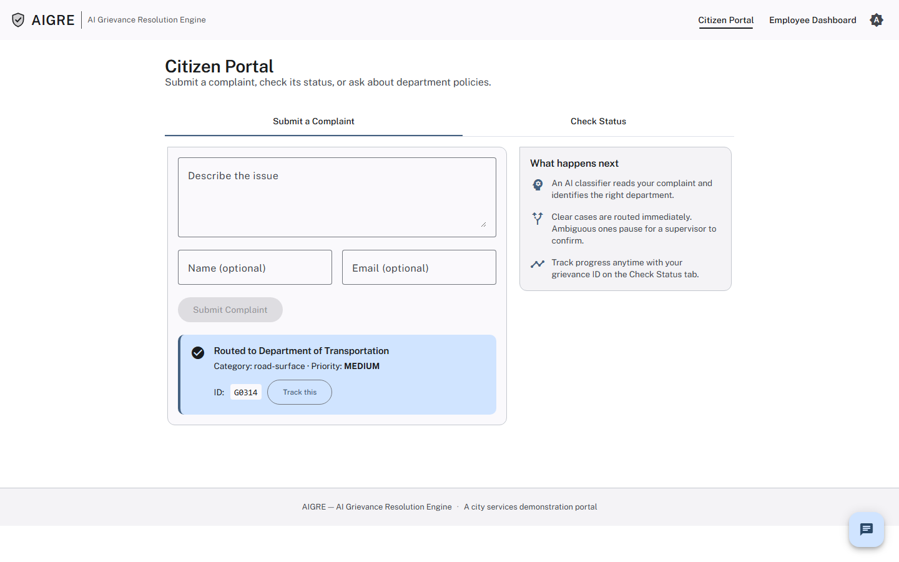

**Example 2 — a vague case that needs a human:**

> *"Things have been bad on my street lately and nobody seems to care."*

Result banner (amber, `hourglass_top` icon):

> **Needs a closer look**
> A supervisor will review your complaint before it's routed. If you can add a bit
> more detail below, we may be able to route it right away instead.

Nothing is guessed here — no department, no priority. This is the human-approval-gate
workflow described in `ARCHITECTURE.md`; the citizen sees the honest "pending" state,
and the case shows up in a supervisor's Pending Review queue on the Employee
Dashboard.

Unlike the plain pause, though, the citizen gets one inline chance to resolve it
themselves first — a small "Can you tell us more?" form appears right in the banner:

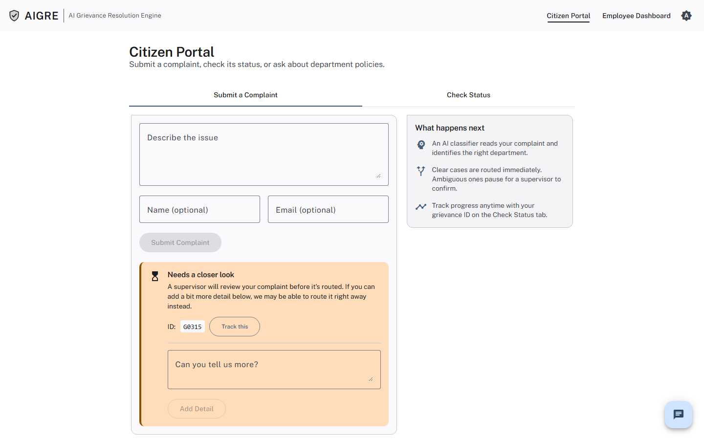

**Example — verified live:** adding *"Specifically there is a large pothole on Elm
Street that has damaged two of my tires this month."* reclassifies the **combined**
text (not just the new sentence) and, since it's now confident, auto-resumes the same
paused workflow — no supervisor needed after all:

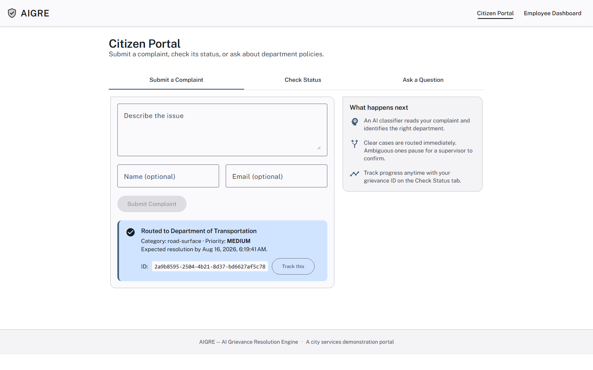

If the added detail still isn't enough to classify confidently, the form reappears
once more (2 attempts total, not one-shot) — classification confidence has documented
run-to-run sampling variance (see `PROJECT.md`), so a second try genuinely has a real
chance of succeeding even with the same or similar wording. Confirmed live: the exact
same clarification text failed once and then succeeded immediately on an identical
retry, no code changes in between. After 2 attempts, the case stays parked for a
supervisor with the fuller text saved either way, and the form doesn't reappear —
bounded, not an open-ended back-and-forth.

**Example 3 — out of scope:**

A pure compliment or a federal/state matter comes back as **"Not something this portal
handles"** with the model's own one-line reasoning, rather than being forced into a
department queue.

### Check Status

Paste a grievance ID, click **Check**. Returns a receipt-style card: status chip,
department, category, priority, submitted date, SLA due date, and resolution notes if
any. Works for *any* grievance ID — one submitted through the workflow, one submitted
through the older plain-intake path, or a seeded demo row — since it reads directly
from the systems-of-record table rather than depending on workflow state.

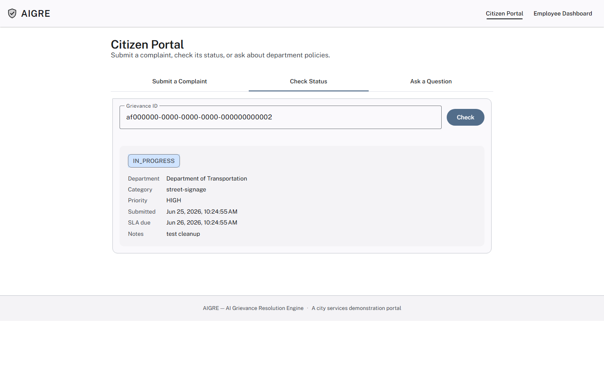

If a submission turns out to match an existing open report in the same
department and category, its status is **DUPLICATE** rather than a routed
priority — it doesn't open a second SLA clock, since the original report
already has one.

If a grievance is **CLOSED**, the card offers a **Reopen this complaint**
button — a short reason, and the case comes back with its priority bumped one
tier (capped at CRITICAL) and a fresh SLA due date, routed back to the same
department for another look.

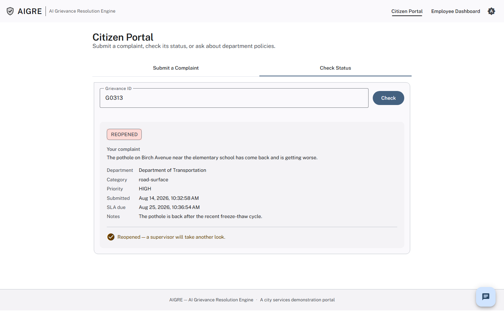

---

## Floating chat (available on every page)

A floating **Chat** button sits bottom-right on every page of the app — not just the
citizen portal — and opens a small panel backed by the same RAG pipeline over the
department policy corpus. It used to be a third tab on the citizen portal ("Ask a
Question"); it's now a site-wide launcher instead, so the same assistant is reachable
from the landing page or mid-way through filling out a complaint, not just from one
specific tab. Empty state offers three clickable example questions. Answers stream in
token-by-token and end with citation cards (document filename + department) for
whatever was actually retrieved and used.

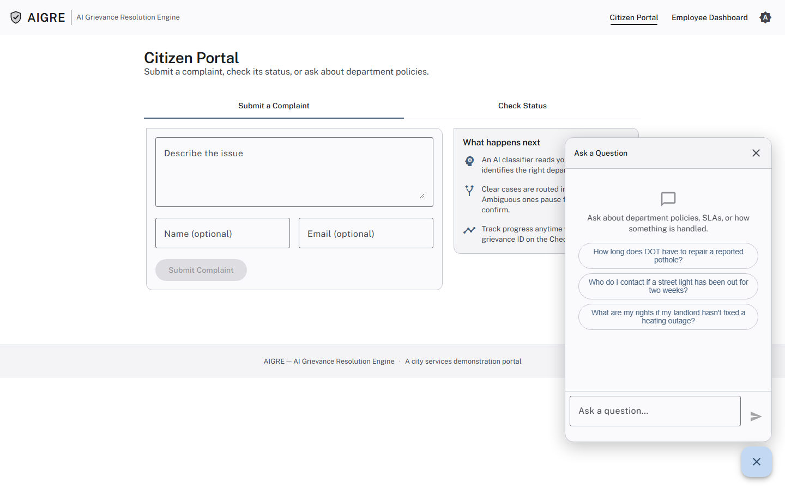

**Example — verified live:**

> *"How long does DOT have to repair a reported pothole once it's submitted?"*

> According to the context provided, for a confirmed pothole classified as Minor or
> Moderate, DOT has to complete the repair within five (5) business days of the
> initial citizen report. For potholes regardless of severity classification, the
> repair should be completed within ten (10) business days of the initial citizen
> report, subject to exceptions under Section 4 due to weather and material
> availability.

Citations here include both `road-maintenance-sop-v2-current.txt` (the current SOP,
which has the answer) and `road-maintenance-sop-v1-superseded.txt` — the corpus's own
deliberate current-vs-superseded distractor, added specifically to test whether
retrieval prefers the current document. The cross-reference-competition fix
(`PROJECT.md`) narrowed this failure mode but didn't eliminate it outright: LLM-rerank
sampling variance means the superseded doc still wins a seat among the top-5 some
runs, as it did for this capture — a known, already-documented finding, not something
hidden here.

**Example — a broader question, multiple sources:**

> *"Give me some details about free immunization"*

> Free immunizations for children can be accessed at walk-in clinics operated by DHHS
> at three community health sites. No complaint or portal submission is required...

Citations: `immunization-clinic-access-faq.txt`, `general-intake-faq.txt`,
`resolved-cases-q2-2026.txt` — deduplicated to one card per source document even
though the underlying retrieval returned multiple chunks from the same file.

If the corpus genuinely doesn't cover a question (e.g. "what's the SLA for a full
highway repaving?"), the answer says so rather than extrapolating from a related
but different SLA.

---

## Employee Dashboard (`/employee`)

Route-guarded — visiting it while logged out redirects to `/login`, a real Spring
Security + JWT sign-in (see `RUNNING.md` for the seeded demo accounts; every seeded
employee shares the password `Demo1234!`).

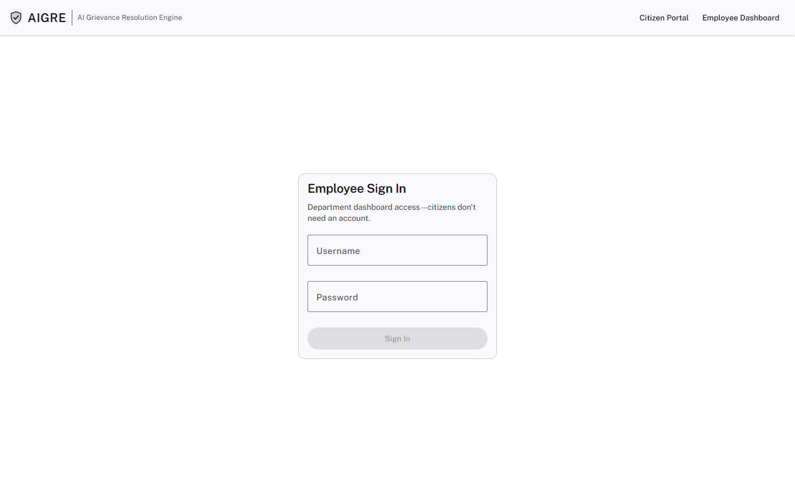

Once signed in, the toolbar shows the employee's name, department, and role — no
picker anymore. Dashboard access is scoped strictly to that employee's own department,
enforced server-side, not just hidden in the UI: the department shown is whatever the
logged-in employee's account belongs to, and every query the dashboard makes is
filtered to it by the backend regardless of what the client asks for.

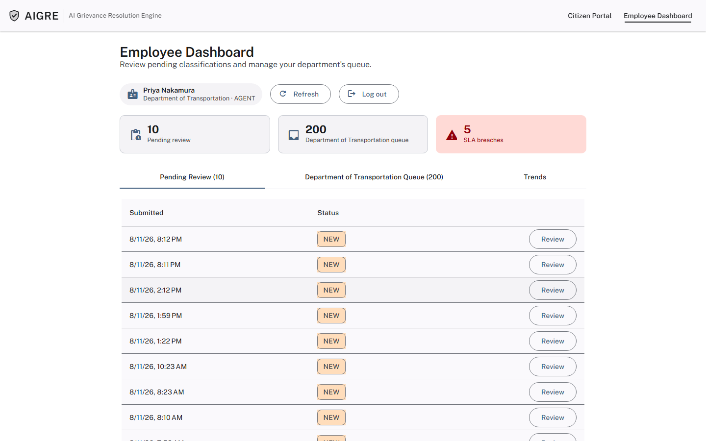

**AGENT vs. SUPERVISOR** — an AGENT can view their department's queue but not act on
it: opening a case shows the classification and reasoning read-only, with a note that
only a supervisor can confirm a routing decision or close a case.

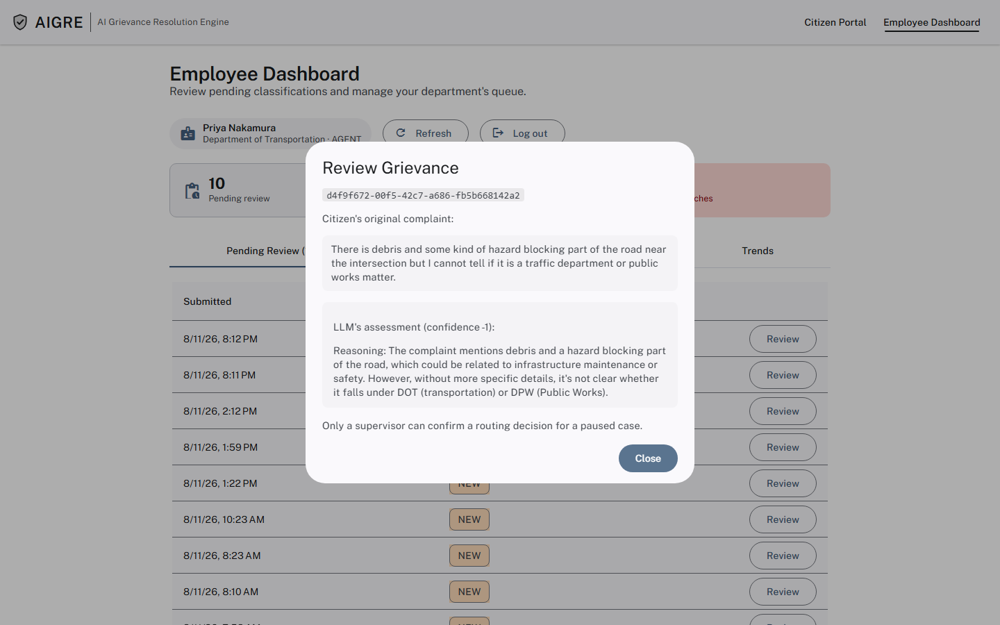

A SUPERVISOR sees the same detail plus the actual controls — **Confirm & Route** for a
paused review, **Mark Resolved**/**Mark Closed** for an open case.

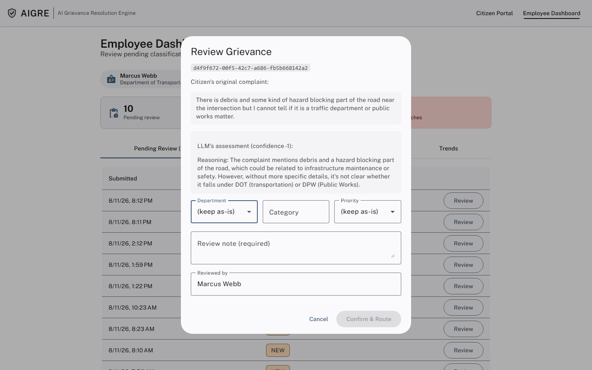

Below the toolbar, a 3-stat summary row: **Pending review** (count, own department),
**{department} queue** (count), **SLA breaches** (flagged
red if non-zero).

### Pending Review tab

A paginated table of every grievance currently paused at the human-review gate for the
logged-in employee's own department (department-scoped, like every other tab now).

Clicking **Review** opens a dialog showing:

- The citizen's original complaint text.
- Any follow-up detail the citizen added via the inline clarification form (see
  above), rendered as its own timestamped section distinct from the original
  complaint — not blended into one paragraph — since a supervisor needs to see at a
  glance what was added and when, not just that more text exists somewhere in the
  block.
- The LLM's confidence score and its reasoning (why it didn't commit to a guess).
- Editable Department / Category / Priority fields, each defaulting to "(keep as-is)"
  — a supervisor only needs to fill in what they're actually overriding.
- A required review note and "Reviewed by" field.

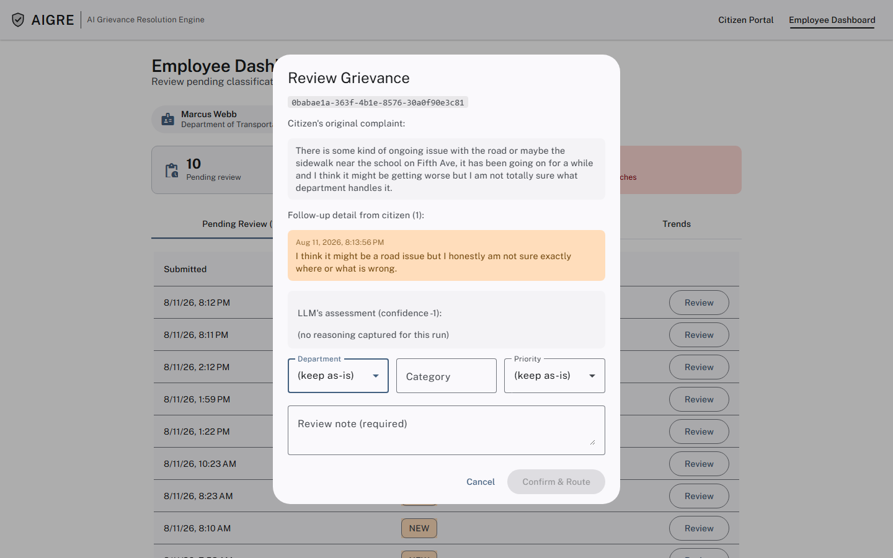

Clicking **Confirm & Route** resumes the paused LangGraph4j workflow with the
decision; the grievance moves to `TRIAGED` with `department_confirmed` now set
(distinct from `department_predicted`, which still shows what the AI originally
guessed).

Opening the same dialog for a grievance that was *never* part of an active workflow
(a seeded demo row, for instance) shows a read-only detail view instead of an editable
form — there's nothing to approve for a case that never paused. For any grievance
that isn't already closed out, this read-only view also offers **Mark Resolved**
and **Mark Closed** — a resolution note and a name/ID, and the status updates
immediately, with the queue table reflecting it on refresh.

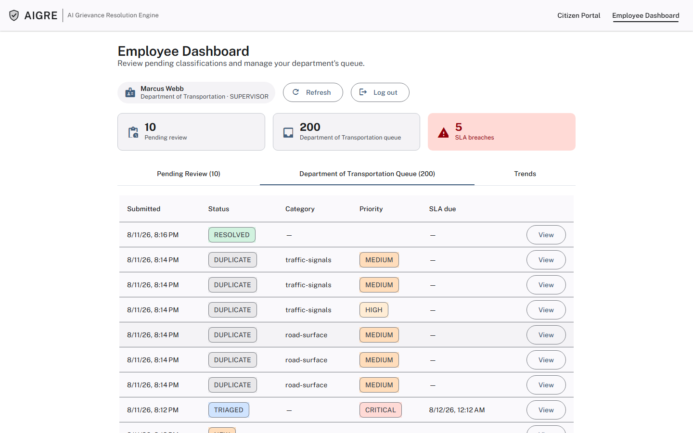

### {Department} Queue tab

A paginated table scoped to the selected department, any status: submitted date,
status, category, priority (color-coded chip), SLA due date, with a red row highlight
and **BREACHED** flag for anything past due and still open. **View** opens the same
detail dialog in its read-only mode.

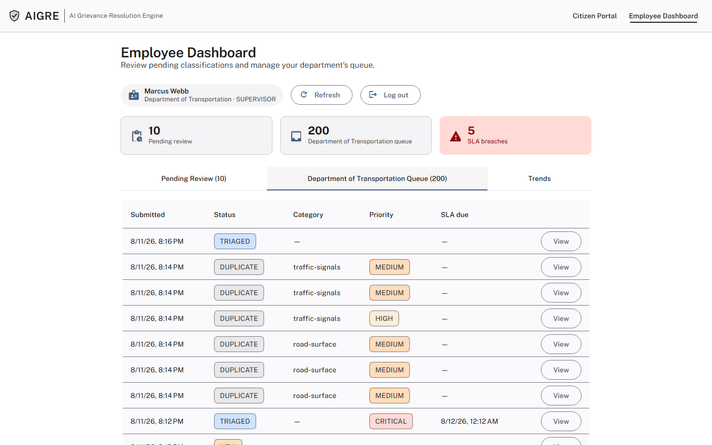

### Trends tab

Two independent toggles: **This Department / All Departments**, and a **7 / 30 / 90
day** window. Four charts plus an SLA snapshot:

- **Volume over time** — daily complaint count, line chart.
- **Sentiment trend** — stacked bar chart, one bar per day, split into 5 named
  confidence bands (No Confidence / Low Confidence / Neutral / Moderate Confidence /
  High Confidence) rather than a single averaged number, so a day where sentiment was
  genuinely mixed looks different from a day where everyone landed in the same band —
  something one averaged line couldn't show.
- **Top categories** — bar chart, top 8 in the selected scope.
- **By priority** — bar chart, CRITICAL/HIGH/MEDIUM/LOW, color-matched to the same
  priority-chip colors used everywhere else in the app.
- **SLA snapshot** — three stat cards: *Resolved on time*, *Resolved late*, *Currently
  breached (open)*. Deliberately three numbers, not one "compliance %" — a closed-late
  case and a still-open breach are different problems worth seeing separately.

---

## What's real vs. demo-only

Worth being explicit about, since it affects how to read a walkthrough of a portfolio
project:

- **Real**: the LLM classification, the RAG retrieval/rerank/citation pipeline, the
  LangGraph4j pause/resume workflow, the MCP tool server, the database and its
  aggregation queries, and employee authentication (Spring Security + JWT,
  department-scoped, role-gated — the department picker is gone, replaced by real
  login). These all run against a live Ollama instance and a live Postgres instance —
  nothing in the walkthrough above is mocked.
- **Demo-grade, not production-grade**: all seeded employee accounts share one
  password, and the Trends tab's "All Departments" toggle is deliberately *not*
  department-restricted (aggregate/statistical, not case-level data — a narrower
  reading of "own department only" than the case-management views). `RESOLVED`/
  `CLOSED`, `ROUTED`/`IN_PROGRESS` ("Start Work"/"Mark In Progress"), and `REOPENED`
  (citizen-facing) all have real dashboard actions now — a supervisor can move a
  triaged case through the full working lifecycle, not just approve its
  classification and close it out.
