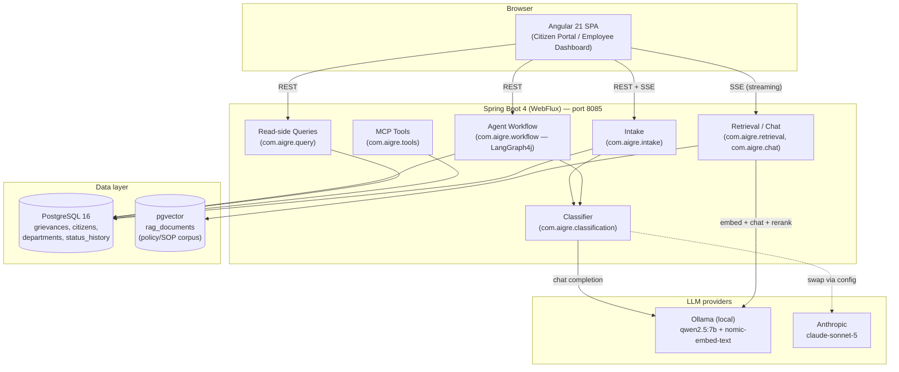
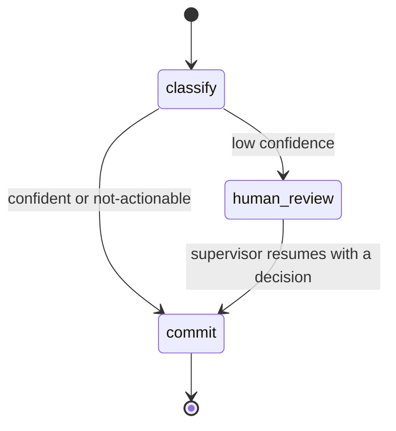
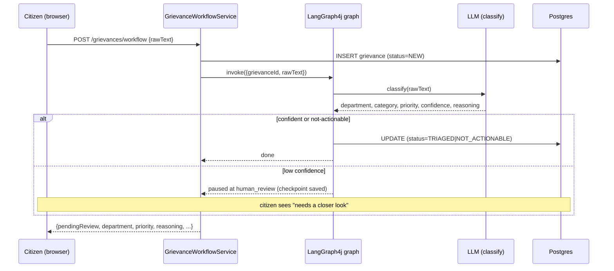
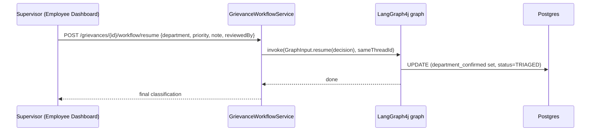
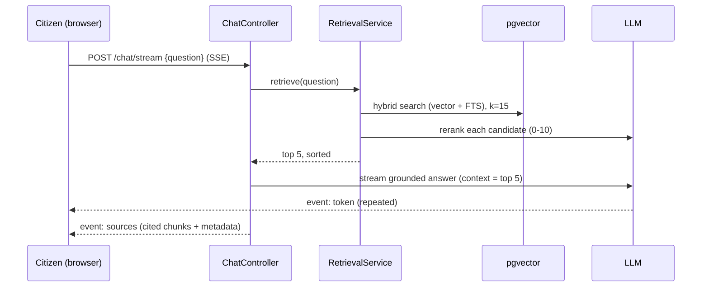

# AIGRE — Architecture

AIGRE (AI Grievance Resolution Engine) is a G2C (government-to-citizen) system for
intake, AI classification, routing, and resolution tracking of city service complaints
("grievances"). This document describes the system architecture, with particular focus
on **where and how AI is used** — that's the load-bearing part of the system, not a
bolt-on feature.

## Contents

- [Tech stack](#tech-stack)
- [System overview](#system-overview)
- [Where AI is used](#where-ai-is-used-the-core-of-this-doc)
- [Backend components](#backend-components)
- [Data flow: three key journeys](#data-flow-three-key-journeys)
- [Data model](#data-model)
- [Frontend architecture](#frontend-architecture)
- [Key design decisions](#key-design-decisions)
- [Known limitations](#known-limitations)

---

## Tech stack

| Layer | Technology |
|---|---|
| Backend language/runtime | Java 21 |
| Backend framework | Spring Boot 4.0.6 (WebFlux — reactive, non-blocking) |
| LLM orchestration | LangChain4j 1.18.0 |
| Agentic workflow / graph orchestration | LangGraph4j 1.8.20 |
| Tool-exposure protocol | Spring AI 2.0.0 GA (MCP server only — Streamable HTTP) |
| Vector store | pgvector (PostgreSQL extension) |
| LLM providers | Ollama (local, default) — `qwen2.5:7b` chat + `nomic-embed-text` embeddings; Anthropic (`claude-sonnet-5`) as a switchable alternative |
| Database | PostgreSQL 16 (via `pgvector/pgvector:pg16` image) |
| Frontend framework | Angular 21 (standalone components, signals) |
| Frontend UI kit | Angular Material 21 (Material 3 / M3 theming) |
| Charts | Chart.js 4.5.1 via ng2-charts 10.0.0 |
| Build tools | Maven (backend), Angular CLI / esbuild (frontend) |

---

## System overview



The backend is a single Spring Boot application; there's no separate microservice
boundary between intake, classification, RAG, and the agent workflow — they're
distinct packages under `com.aigre.*`, not distinct deployables. The frontend is a
separate Angular SPA that talks to the backend over plain REST (JSON) and one
Server-Sent-Events stream (chat).

---

## Where AI is used (the core of this doc)

AIGRE uses AI in four distinct, purpose-built ways. None of them are "call an LLM and
hope" — each has a defined correctness contract, a deterministic fallback where one
exists, and a human checkpoint where the AI's confidence is genuinely insufficient.

### 1. Grievance classification (`LlmGrievanceClassifier`)

**What it does**: one LLM call per submitted grievance determines `department`,
`category`, `priority`, `confidence`, `sentimentLabel`/`sentimentScore`, and an
`actionable` flag — replacing what would otherwise be a citizen manually picking a
department from a dropdown (which citizens routinely get wrong for genuinely
cross-department issues).

**How it's prompted** — a single structured prompt, not a chain of calls:
- A domain glossary of all 6 departments (DOT, DPW, DHHS, DOE, DHUD, DEP) with
  explicit disambiguation rules for the deliberately-overlapping cases (e.g. "DPW owns
  infrastructure hazards even when they sound environmental — a gas smell from a
  sewer/manhole is DPW's, not DEP's").
- A deterministic priority rubric the model is told to *apply*, not invent
  (CRITICAL = active safety hazard, HIGH = outage affecting many / vulnerable
  population, MEDIUM = default, LOW = cosmetic).
- Explicit confidence guidance: low confidence for genuinely vague text, mid
  confidence for real department ambiguity, high confidence only when both the issue
  and department are clear — **the model is told not to force a guess**.
- **Reason-before-verdict**: the model writes a short prose justification, then emits
  exactly one line starting `RESULT:` followed by single-line JSON. Parsing regexes
  for the `RESULT:` marker rather than asking the model for JSON-only output — smaller
  local models follow instructions more reliably when allowed to reason first.
- 3 few-shot examples spanning different departments (deliberately diversified after a
  real bug: two same-department examples measurably biased the model toward
  over-predicting that department).

**Why not structured-output / function-calling?** Ollama's `ChatModel` doesn't declare
`RESPONSE_FORMAT_JSON_SCHEMA` support by default. Rather than doing per-provider
capability verification, the project reuses the same reason+marker pattern proven in
the RAG reranker (below) — one verified pattern, two call sites, not two.

**Defensive parsing**: two real bugs found via live debugging are now handled
defensively — models sometimes emit unquoted enum-like values (`"priority": LOW`
instead of `"LOW"`, fixed by a sanitizing regex) and sometimes emit the string
`"null"` instead of a JSON `null` literal (fixed by treating the literal text "null"
as null).

**Provider comparison, measured, not assumed**: run head-to-head against the same
91-case labeled eval set, Anthropic (`claude-sonnet-5`) scored 95.6% vs. Ollama's
65.9–86.8% (varies run to run — real sampling variance, not test flakiness, confirmed
by re-running the identical input in isolation). Anthropic's errors were all
genuinely-ambiguous cases; Ollama's included systematic department-boundary
confusion. Ollama stays the default (offline, no per-call cost); Anthropic is a
one-line config flip for when accuracy matters more than cost.

**Citizen-driven reclassification** (`GrievanceWorkflowService.clarify()`): when a
submission pauses for low confidence, the citizen gets up to two inline chances to
add detail before it ever reaches a supervisor. Each follow-up is stored as its own
row (`grievance_clarifications`) rather than mutated into the original complaint
text, so the employee dashboard can show them as distinct, timestamped entries; the
original text plus every follow-up so far is combined in-memory and run back through
the same classifier. If the combined text is now confident, the service auto-resumes
the already-paused LangGraph4j workflow itself —
reusing the exact same resume mechanism a supervisor's decision uses, just with the
reclassification's own department/category/priority/confidence/reasoning standing in
for a human's typed choices (`reviewedBy: "system:citizen-clarification"` in the audit
trail, so it's distinguishable from an actual human review). If it's still not
confident, nothing is force-committed — it stays paused for a supervisor, but with the
fuller text now saved so they see the citizen's complete context either way.

### 2. Retrieval-augmented chat (`RetrievalService`, `ChatController`)

**What it does**: answers citizen policy questions ("How long does DOT have to fix a
pothole?") by retrieving the actual policy document and having the LLM answer *only*
from that retrieved text — with a citation, and a refusal (not a fabrication) when the
corpus doesn't contain the answer.

**Pipeline**:
1. **Embed** the query (`nomic-embed-text`, 768-dim).
2. **Hybrid retrieval** — `PgVectorEmbeddingStore.SearchMode.HYBRID` fuses cosine
   similarity with Postgres full-text search via Reciprocal Rank Fusion, natively
   (no hand-rolled SQL). Retrieves `initial-k` = 15 candidates.
3. **LLM rerank** — each candidate is scored 0–10 for relevance to the actual question
   by a second LLM call (reason-then-`SCORE:`-marker, the same pattern as
   classification), then the top `rerank-to` = 5 survive.
4. **Grounded generation** — the surviving chunks are concatenated into the prompt
   context; the model is instructed to answer *only* from that context and say "I
   don't know" rather than guess.
5. **Streamed response** — tokens stream to the browser via SSE as they're generated,
   followed by a final `sources` event carrying the cited chunks' metadata
   (`department`, `source` filename) so the UI can show real citations, not just prose.

**Why LLM rerank instead of trusting cosine similarity?** Measured directly: an
irrelevant chunk scored a *higher* cosine similarity (0.789) than the actually-relevant
one (0.788) on a real query. Cosine alone can't tell "on-topic" from "answers the
question" — a cross-encoder or LLM judging pass is required. This project uses an LLM
judge (a dedicated cross-encoder was attempted and reverted — see
[Known limitations](#known-limitations)).

**Cross-reference-competition, fixed via corpus restructuring**: department policy
documents deliberately contain disambiguating cross-references ("this is a DPW matter,
not DEP's — see Policy 4.2"), per the corpus's own realism requirements. Those
sentences contain the *other* department's keywords, so they sometimes outscored the
actually-correct document — confirmed reproducible across three separate eval runs as
corpus size grew, and two earlier fix attempts (an elaborate rerank prompt; a dedicated
ONNX cross-encoder) were tried and reverted (see [Known limitations](#known-limitations)).

Fixed at the corpus level instead: authors wrap a disambiguating clause inline in the
source `.txt` with `[[XREF]]...[[/XREF]]`. `CorpusIngestionService` bypasses
`EmbeddingStoreIngestor` (which embeds and stores the same string by construction, no
interception point) for a manual split → strip → embed → store loop, giving each chunk
up to **three** text representations: the *embedded* text and a `rerank_text` metadata
field both have marked spans removed entirely (so neither the vector similarity nor
`RetrievalService`'s LLM rerank score — which actually decides the final top-1 — can be
swayed by them); the *stored/returned* text keeps the full original prose, so nothing
is lost for the answering LLM or a citizen reading a citation. Verified via the same
"diff the failure sets across full eval-suite runs" discipline used throughout this
project: 5 of the 6 originally-named failures now pass outright, one narrowed (its
named distractor no longer wins, though a separate, already-documented failure mode —
concrete resolved-case narratives outranking abstract policy prose — still blocks it),
net **28/34 → 29/34** on the eval suite. Two residual, unrelated failure families
remain, deliberately left as known findings rather than chased or hidden: that
resolved-case-log competition, and ordinary LLM-rerank sampling variance (the same
pattern documented throughout this project's classifier work). Full investigation,
including a real mid-implementation correction (an embed-only version of this fix
proved insufficient — see the third bullet above about `rerank_text`) and the exact
eval numbers per run, in `PROJECT.md`.

### 3. Agentic workflow with a human approval gate (`com.aigre.workflow`, LangGraph4j)

**What it does**: routes a submitted grievance through a small state graph —
`classify → (confident? commit : human_review) → commit` — where genuinely
low-confidence or ambiguous classifications **pause execution** and wait for a human
supervisor's decision instead of auto-committing a guess.



- **`classify`** calls the same `LlmGrievanceClassifier` used by plain intake, but
  routes on the result: `actionable && !isConfident()` → pause.
- **`human_review`** is an `interruptBefore` gate — LangGraph4j's checkpointer
  captures the graph's state and execution genuinely stops, resuming only when a
  supervisor calls `POST /grievances/{id}/workflow/resume` with a decision (which
  fields to override, a note, and who reviewed it). The frontend's Employee Dashboard
  surfaces this as the "Pending Review" queue.
- **`commit`** writes the final department/category/priority/status to Postgres —
  `department_predicted` (the LLM's original guess) is preserved separately from
  `department_confirmed` (only set if a human actually reviewed it), so the audit
  trail shows what the AI guessed vs. what a person confirmed.

**This is the single most deliberate AI-safety mechanism in the system**: rather than
forcing every classification to a department (and being wrong sometimes with no one
noticing), the graph explicitly routes low-confidence cases to a human, and the UI
shows the human *why* the AI was unsure (the model's own reasoning text) before asking
them to decide.

Checkpointing currently uses LangGraph4j's in-memory `MemorySaver` — a paused review
does not survive an application restart (documented open item; `langgraph4j-postgres-
saver` exists upstream if this becomes a real requirement).

### 4. MCP tools (`com.aigre.tools.GrievanceMcpTools`)

**What it does**: exposes 5 grievance operations (`get_grievance_status`,
`check_sla_status`, `find_duplicate_chain`, `update_grievance_status`,
`reopen_grievance`) as MCP (Model Context Protocol) tools via Spring AI's MCP
server (Streamable HTTP transport), so an external agent could call them the
same way a human uses the REST API.

This is the **tool-exposure layer for a future AI agent**, not the workflow's own data
access (the workflow graph currently writes to Postgres directly, matching the plain
intake service's pattern — wiring the graph to *call* these MCP tools instead of
direct JDBC is a documented follow-up, not yet done). Each tool's error messages are
written to teach the caller what to do next (e.g. "Double-check the ID, or use a
search/list tool") rather than just reporting failure — tool quality is answer
quality, especially for a caller that might itself be an LLM.

`find_duplicate_chain` only ever *walked* an existing `duplicate_of_id` chain;
what actually *creates* that link is `DuplicateDetectionService`
(`com.aigre.duplicate`), a plain SQL match on department+category within a
recent window (no structured location field exists in the schema — free-text
`raw_text` only — so that's the narrowest usable signal), wired into both
commit paths (plain intake and the workflow's `commit()` node) right before
each one writes its final row. A match sets status to `DUPLICATE` and skips
assigning an SLA due date, since a duplicate doesn't open a second clock.
`reopen_grievance` only succeeds from `CLOSED`, bumps priority one tier
(`Priority.oneTierUp()`, capped at `CRITICAL`), explicitly clears
`resolved_at` (a real gap in `update_grievance_status`, whose `resolved_at`
CASE expression only ever sets that column, never nulls it — a naive reopen
through that tool alone would leave a stale resolution timestamp on an active
case), and recomputes a fresh SLA due date. Both are exposed over plain HTTP
too (`POST /grievances/{id}/reopen`, citizen-facing; `POST
/grievances/{id}/status`, the employee dashboard's "Mark Resolved"/"Mark
Closed" action) via `GrievanceQueryController`, alongside its existing
read-only endpoints.

### Cross-cutting: dual-provider architecture

Every LLM call in the system goes through LangChain4j's `ChatModel`/
`StreamingChatModel` abstraction, with the concrete provider selected by one config
property (`llm.provider: ollama | anthropic`, `LlmProviderConfig`). Same prompts, same
code paths, different model underneath — this is what made the head-to-head accuracy
comparison in §1 a one-line config change rather than a parallel implementation.

### Cross-cutting: guardrails (`com.aigre.guardrail`)

Citizens type free text into a public portal, and free text sometimes contains PII
that was never meant to be typed into it — a phone number, an SSN, a card number
volunteered while explaining an unrelated complaint. `PiiRedactionWebFilter`
intercepts the 3 POST endpoints that carry citizen free text
(`/grievances`, `/grievances/workflow`, `/grievances/{id}/workflow/clarify`),
buffers and rewrites the request body before it reaches any controller, and
replaces SSN/credit-card/phone/email matches with a `[REDACTED-*]` marker via
`PiiRedactor` (regex-based, deliberately narrow patterns — false negatives on
unusual formats are an accepted tradeoff for zero false positives on ordinary
complaint text like a street address). A `WebFilter`, not a `HandlerInterceptor`:
this app is WebFlux end to end, and `HandlerInterceptor` is Spring MVC-only.

Scoped to exactly the free-text fields (`rawText`, `additionalText`) — the
structured `citizenEmail`/`citizenPhone` contact fields are untouched, since
they're legitimate contact info, not incidental PII. Redaction happens before
storage *and* before the text reaches the classifier/LLM.

Verified against the ground truth already named in the domain plan (eval
question #13): `test-data/grievances/eval-complaints.jsonl` has 4 PII-laced
complaints (GRV-074..077, `expected_redaction: true`) covering all 4 patterns.
`PiiRedactorTest` asserts the regex logic directly against those literal
strings; `PiiRedactionWebFilterTest` posts through a real embedded HTTP server
(`WebTestClient` against `@LocalServerPort`, classifier mocked) and queries
Postgres afterward to confirm the *stored* `raw_text` is redacted — a
service-layer test can't verify this, since the filter only runs on the actual
HTTP path. One limitation worth naming: `ComplaintEvalHarnessTest` (the
department-accuracy eval) calls `GrievanceIntakeService.submit()` directly and
so never exercises this filter — its 4 PII-laced rows pass through unredacted
in that harness even though the same rows are redacted for real over HTTP.

### Cross-cutting: observability

Every step in the classification and retrieval pipelines is wrapped in
`LlmCallTimer`, tagged by call type (`classification` / `rerank` / `embed` /
`vector_search`) under one metric, `aigre.llm.call` — deliberately one metric
family covering both real LLM inference calls and the non-LLM pgvector search
step around them, so a single dashboard panel can compare which step is
actually slow across the whole pipeline. This was a real finding, not a
hypothetical: in earlier project work, a "critic" LLM step turned out to be
53% of total runtime — more than the step it was reviewing. Instrumenting
every call site from day one is a standing practice here, not an afterthought.

The streaming chat endpoint doesn't fit `LlmCallTimer`'s synchronous
Supplier shape (it completes via an async callback, not a return value), so
it gets its own two metrics recorded directly in `SseTokenStreamingHandler`
via a Micrometer `Timer.Sample`: `aigre.chat.time_to_first_token` and
`aigre.chat.stream_duration` (tagged `outcome=success|error`) — the two
latency numbers that actually matter for a streaming UX, distinct from a
single blocking-call duration. The PII guardrail (previous section) also
exposes `aigre.guardrail.pii_redacted`, a `Counter` tagged by PII type and
field, alongside its WARN log line — a log line alone isn't queryable, and
"how often is this actually happening" is exactly the kind of thing that
shouldn't be guessed.

All of the above are visible at `/actuator/metrics/<name>` and, since
`micrometer-registry-prometheus` is on the classpath, scraped in Prometheus
exposition format at `/actuator/prometheus` — the latter was listed in
`management.endpoints.web.exposure.include` from day one but the actual
registry dependency was missing until this pass, so the endpoint 404'd
despite being "exposed"; caught while extending this section, not by any
external monitoring (there isn't any here — a real deployment would point a
Prometheus scrape config at this endpoint and layer Grafana on top, neither
of which exists in this repo).

---

## Backend components

| Package | Responsibility |
|---|---|
| `com.aigre.intake` | Plain complaint intake (`POST /grievances`) — the pre-agentic-workflow path; still used, sets `NEEDS_CLARIFICATION` on low confidence rather than pausing for a human |
| `com.aigre.classification` | `LlmGrievanceClassifier`, `ClassificationResult` — the classification LLM call and its parsing |
| `com.aigre.workflow` | The LangGraph4j agent graph, its Spring Boot wiring, and the pause/resume REST endpoints |
| `com.aigre.retrieval` | Hybrid retrieval + LLM rerank over the pgvector policy corpus |
| `com.aigre.chat` | The SSE streaming chat endpoint that composes retrieval + grounded generation |
| `com.aigre.ingestion` | Corpus ingestion (`POST /ingest/reset`) — loads `test-data/documents/**` into pgvector with `department`/`source` metadata |
| `com.aigre.tools` | MCP tool definitions over the grievance systems-of-record |
| `com.aigre.query` | Read-side REST for the frontend: status lookup, filtered listing, and trend aggregation — deliberately separate from the MCP tool surface |
| `com.aigre.sla` | `SlaCalculator` — a pure function, no LLM, priority → due-date |
| `com.aigre.config` | Provider selection (`LlmProviderConfig`), pgvector store setup (`RagConfig`), CORS, and the centralized error-body `@RestControllerAdvice` |
| `com.aigre.metrics` | `LlmCallTimer` — per-call-type LLM timing |

---

## Data flow: three key journeys

**Citizen submits a grievance (agentic path, what the frontend actually uses):**



**Supervisor resolves a paused review:**



**Citizen asks the chatbot a policy question:**



---

## Data model

Two distinct data stores, deliberately not conflated:

- **Systems-of-record** (plain PostgreSQL tables) — `grievances`, `citizens`,
  `departments`, `department_employees`, `sla_policies`, `status_history`. The
  `grievances` table is the center of the schema: `department_predicted` /
  `department_confirmed` are separate columns specifically so the audit trail
  distinguishes an AI guess from a human confirmation. `department_predicted` /
  `department_confirmed` / `assigned_department` are deliberately **not** foreign keys
  to `departments`, so a legacy/bad department code can be seeded and surfaced as an
  error condition rather than silently rejected.
- **RAG knowledge corpus** (`rag_documents`, managed by `PgVectorEmbeddingStore`) —
  chunked policy/SOP/FAQ text with `department` and `source` (filename) metadata,
  entirely separate from the systems-of-record tables above.

**Status state machine** (`grievances.status`):

```
NEW → NEEDS_CLARIFICATION → TRIAGED → ROUTED → IN_PROGRESS → RESOLVED → CLOSED
                                  ↘ ESCALATED ↗
                REOPENED (from CLOSED)   NOT_ACTIONABLE (terminal)   DUPLICATE (terminal)
```

Only `NEW`, `NOT_ACTIONABLE`, `NEEDS_CLARIFICATION`, and `TRIAGED` are currently set by
live application logic (classification + the workflow graph). The rest
(`ROUTED`/`IN_PROGRESS`/`RESOLVED`/`CLOSED`/`ESCALATED`/`REOPENED`/`DUPLICATE`) are
valid, audited transitions via `update_grievance_status`, meant to be driven by a
caseworker actually working the ticket — there's no UI for those transitions yet.

---

## Frontend architecture

Angular 21, **standalone components only** (no NgModules), Angular Material 21 (M3
theming, a custom navy/amber palette generated via
`ng generate @angular/material:m3-theme`, not the stock palette). Three routed pages:

- **`/`** — landing, two entry cards.
- **`/citizen`** — three tabs: submit a complaint (posts to the workflow endpoint),
  check status by grievance ID, and the RAG chatbot (hand-rolled SSE parsing via
  `fetch()` + `ReadableStream`, since the endpoint is POST-based and the browser's
  native `EventSource` is GET-only).
- **`/login`** — employee sign-in; **`/employee`** (route-guarded, redirects to
  `/login` if not authenticated) — three tabs: Pending Review, a department-scoped
  queue with pagination, and Trends (Chart.js visualizations — volume, category,
  priority, sentiment, SLA snapshot).

Chart.js (~170KB) is scoped to the `Trends` component's own `providers` array rather
than registered app-wide, so the citizen-facing routes don't pay for a dependency they
never use — confirmed via bundle analysis, not assumed (an earlier attempt to scope it
via the route's `providers` array in `app.routes.ts` looked correct but didn't
actually move the code out of the eager bundle, because top-level static imports in
that file get bundled eagerly regardless of when the provider function runs; scoping
it inside the lazily-loaded component itself was the fix that actually worked).

### Cross-cutting: employee authentication (`com.aigre.auth`)

Replaced the milestone-5 department-picker stub with real Spring Security + JWT, tied
to `department_employees` (which gained `username`/`password_hash` columns for this).
`POST /auth/login` validates against a bcrypt hash and issues a JWT (`JwtService`,
`io.jsonwebtoken`) carrying the employee's id/department/role as claims — no session
state, no per-restart-random signing key (that would log every employee out on every
backend restart during dev). `JwtAuthenticationWebFilter` validates the bearer token
and populates the reactive `SecurityContext`; registered directly inside
`SecurityConfig`'s `SecurityWebFilterChain`, not as a `@Component`, so it runs inside
Spring Security's own filter chain and context propagation rather than as a second,
independently-ordered generic `WebFilter` (the same category of gotcha as
`PiiRedactionWebFilter`, for a different reason).

**Department scoping is enforced server-side, not just "logged in or not."**
`GrievanceQueryController.list()` derives its department filter from the authenticated
principal directly — never a client-supplied query parameter — so a DOT employee's
token can't be used to request another department's queue. The four endpoints that act
on a specific grievance by ID (view/resume the paused workflow, mark resolved/closed)
additionally compare the grievance's own department against the principal's
(`DepartmentAccess.requireOwnDepartment`) before allowing the action, since role-based
route rules alone don't stop an authenticated employee from reaching another
department's grievance by ID. AGENT can view; SUPERVISOR can additionally resume a
review or mark a grievance resolved/closed (`hasRole("SUPERVISOR")` in
`SecurityConfig`, mirrored in the frontend for UX — the backend check is the actual
enforcement).

Citizen-facing endpoints (submit, status lookup, clarify, reopen) and the chat endpoint
stay fully public — citizens never log in. A real gap caught and fixed while building
this: `pathMatchers(GET, "/grievances/{id}")` (public, the citizen status lookup) also
matches `/grievances/trends` — `{id}` matches any single path segment — which would
have silently made the employee-only Trends endpoint public too; caught by testing the
actual URL rather than assuming the rule was scoped correctly, fixed with a
more-specific rule ordered first (`authorizeExchange` matches in declaration order).

---

## Key design decisions

- **Deterministic where possible, LLM only where genuinely subjective.** Priority is a
  rules function over rubric signals, not a free LLM guess. SLA due dates are a pure
  function. Only classification department/category, sentiment nuance, and open-ended
  chat phrasing actually need a model.
- **Reason-before-verdict for every LLM judgment.** Classification and reranking both
  make the model write its reasoning before a machine-parsed verdict line — this is a
  standing project rule, not incidental to these two call sites.
- **A human approval gate is a first-class workflow state, not an error path.**
  Low-confidence classification pausing for supervisor review (via LangGraph4j's
  `interruptBefore`) is the core of milestone 4, not a fallback bolted onto milestone 2.
- **Provider-swappable by one config line.** Every LLM call goes through LangChain4j's
  abstraction; this made a real accuracy comparison (Ollama vs. Anthropic) cheap to run
  and is why the project can stay offline-by-default without losing the ability to
  reach for a stronger model.
- **Every retrieval/classification claim gets measured, not assumed.** Cosine-vs-rerank,
  provider comparison, prompt-tweak regressions — all verified with live eval runs
  against labeled data, including reverting changes that measured worse net despite
  fixing their target cases.

---

## Known limitations

Full detail lives in `PROJECT.md`; the headline items:

- **Retrieval cross-reference competition** — mostly fixed via corpus restructuring
  (see §2 above): 5 of 6 originally-named failures now pass, the 6th narrowed. Two
  separate, unrelated failure families remain as known findings (resolved-case-log
  competition; LLM-rerank sampling variance), not targeted by this fix.
- **In-memory workflow checkpointing** — a paused human-review case is lost on
  application restart. `langgraph4j-postgres-saver` is the documented upgrade path.
  path.
- **Employee auth is real (Spring Security + JWT, department-scoped, role-gated) but
  demo-grade**: all 12 seeded accounts share one password, the signing secret is a
  fixed value in `application.yml` rather than a secrets manager, and there's no
  refresh-token flow (an 8-hour token, then a re-login) — see `RUNNING.md` for the
  seeded credentials.
- **The workflow graph writes to Postgres directly** rather than calling the MCP tools
  from §4 as actual tool-use — the MCP server and the agent workflow are both built,
  but not yet wired to each other.
- **Business-hours-unaware SLA calendar** — `SlaCalculator` uses flat calendar-hour
  arithmetic, not a business-hours calendar.
